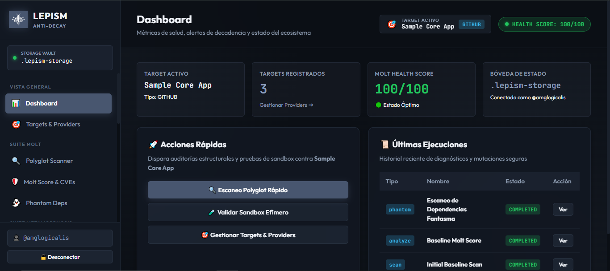
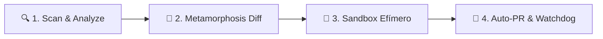

<div align="center">
  
  <h1>LEPISM</h1>
  <p><strong>Motor de Salud Estructural, Mapeo Polyglot de Dependencias y Anti-Decadencia</strong></p>
  
  <p>
    <a href="https://amglogicalis.github.io/lepism-repo-public/"></a>
    
    
    
    
  </p>

  <p><em>Auditoría inteligente de salud estructural, análisis de cambios de API (Breaking Diffs) y validación en sandboxes efímeros de GitHub Actions a $0 coste.</em></p>
</div>

---

## 📸 Vista Previa de la Consola Web

<div align="center">
  <a href="https://amglogicalis.github.io/lepism-repo-public/">
    
  </a>
  <p><em>Consola Web Interactiva (Dark Mode / Glassmorphism en tono <code>#48566f</code>) con selector dinámico de Targets y conexión directa con tu bóveda <code>.lepism-storage</code>.</em></p>
</div>

👉 **[Abrir Consola Web Oficial desplegada en GitHub Pages](https://amglogicalis.github.io/lepism-repo-public/)**

---

## 💡 ¿Qué es Lepism?

**Lepism** (inspirado en *Lepisma saccharina*, el pececillo de plata que sobrevive al paso del tiempo) es el motor de **salud estructural, mapeo inteligente de dependencias y prevención de decadencia tecnológica** del ecosistema Terra.

A diferencia de las herramientas tradicionales que abren Pull Requests ciegos o se limitan a auditorías estáticas:
* **🧪 Ejecuta tus tests reales en un Sandbox Efímero ($0)** antes de aplicar cualquier actualización en producción.
* **🔬 Compara la API pública y tipos de TypeScript (*Metamorphosis Diff*)** para detectar funciones eliminadas o firmas alteradas antes de tocar código.
* **🎯 Soporta Múltiples Providers y Targets Reales**: Audita repositorios de GitHub, Buckets S3 (AWS / MinIO / R2), URLs remotas o rutas en disco local.
* **⏱️ Rastrea Ciclos de Vida y Fechas EOL** de tus runtimes (Node.js, Python, PostgreSQL, Ubuntu).
* **👻 Detecta Dependencias Fantasma y Ghosts** (librerías usadas en código no declaradas y librerías declaradas nunca utilizadas).
* **🔑 Optimiza y Deduplica Lockfiles** (`package-lock.json`, `yarn.lock`, `Cargo.lock`) limpiando ramas huérfanas y validando hashes de integridad.

---

## 🎯 Sistema de Targets & Providers

Lepism cuenta con un **Gestor Transversal de Targets** disponible en la Consola Web, el CLI y el SDK:

| Tipo de Provider | Propósito | Parámetros de Conexión | Entornos Compatibles |
| :--- | :--- | :--- | :--- |
| **🐙 Repositorio GitHub** | Código fuente y runners | `owner/repo`, `branch`, `monorepoPath`, `githubToken` | Web Online, Localhost, CLI, SDK |
| **☁️ S3 / Cloud Storage** | Artefactos y manifiestos | `s3Bucket`, `s3Region`, `s3Endpoint`, Access & Secret Keys | Web Online, Localhost, CLI, SDK |
| **🌐 Web App / URL** | Registros privados o públicos | `manifestUrl`, `authHeader` (Bearer / API Key) | Web Online, Localhost, CLI, SDK |
| **💻 Entorno Local** | Rutas directas en disco | `localPath` (ej. `./packages/backend/package.json`) | Localhost (`lepism console`), CLI, SDK |

> [!NOTE]
> En la versión web online de GitHub Pages, los navegadores tienen restringido el acceso al disco local por seguridad. Para analizar rutas locales en disco, inicia la consola localmente con `lepism console --port 7420` o utiliza el CLI / SDK.

---

## 🚀 Flujo de Trabajo Recomendado (4 Pasos)



1. **Paso 1 — Escaneo & Molt Score (`scan` & `analyze`)**: Escanea tu manifiesto sin instalar dependencias. Lepism calcula tu **Molt Score** (0-100) y cruza vulnerabilidades en tiempo real con OSV.dev.
2. **Paso 2 — Inspección de Cambios de API (`metamorphosis`)**: Si una librería tiene un salto mayor, inspecciona las funciones eliminadas o modificadas antes de escribir código.
3. **Paso 3 — Validación en Sandbox Efímero (`sandbox`)**: Genera e inyecta un runner de GitHub Actions que clona tu repo, aplica la versión candidata y ejecuta tu suite de pruebas real (`npm test`, `pytest`, `cargo test`).
4. **Paso 4 — Automatización Segura (`autopr` & `schedule`)**: Abre Pull Requests enriquecidos con reportes del sandbox y programa el watchdog semanal para monitorizar la salud continuamente.

---

## 🛠️ Catálogo de las 12 Funciones

### 🧬 MOLT Suite — Análisis e Inteligencia de Riesgo
* **🔍 Polyglot Scanner (`scan`)**: Lee manifiestos de Node.js, Python, Rust, Go y Ruby consultando registros públicos vía HTTP sin instalación.
* **🛡️ Molt Score & CVEs (`analyze`)**: Clasifica dependencias en `SAFE_MOLT` 🟢, `RISKY_MOLT` 🟡 y `TOXIC_MOLT` 🔴 calculando penalizaciones por CVEs activos y saltos mayores.
* **👻 Phantom Dependencies (`phantom`)**: Escanea código fuente para identificar paquetes importados que no están declarados en los manifiestos (Phantoms) y librerías declaradas no usadas (Ghosts).

### 🔬 METAMORPHOSIS Suite — Diff Profundo de APIs y Ciclos de Vida
* **🔬 API Breaking Diff (`metamorphosis`)**: Compara archivos de definición de tipos (`.d.ts`) y exports entre versiones para detectar métodos eliminados o firmas alteradas.
* **⏱️ Runtime EOL Tracker (`epoch`)**: Rastrea el calendario oficial de soporte y fin de vida (EOL) de Node.js, Python, PostgreSQL, etc., mediante la API de *endoflife.date*.
* **💥 Peer Collision Detector (`collision`)**: Encuentra conflictos de versiones cruzadas en `peerDependencies` y duplicados en el árbol de dependencias.

### 🛡️ EXOSKELETON Suite — Sandbox Efímero y Actualizaciones Seguras
* **🧪 Ephemeral Sandbox (`sandbox`)**: Ejecuta un runner efímero de GitHub Actions que valida tu suite de pruebas real contra la nueva versión sin tocar producción.
* **🦎 Smart Molt Upgrade (`molt`)**: Genera parches atómicos de manifiesto con verificación de compatibilidad previa.
* **🚀 Autonomous Auto-PR (`autopr`)**: Abre Pull Requests automáticos con el reporte de Metamorphosis y el log de validación del sandbox adjuntos.

### 🏛️ FOSSIL Suite — Registro Histórico y Automatización
* **🏛️ Genealogy Ledger (`fossil`)**: Guarda en `.lepism-storage` el historial inmutable de todas las mutaciones, auditorías y regresiones detectadas.
* **⏰ Health Watchdog Cron (`schedule`)**: Genera workflows de GitHub Actions con cron programable y alertas a Discord, Slack o GitHub Issues.
* **🔑 Locksmith Linter (`locksmith`)**: Optimiza y deduplica lockfiles (`package-lock.json`, `yarn.lock`, `Cargo.lock`) verificando sumas de integridad SHA.

---

## 💻 CLI — Instalación y Uso

### Instalación Global

```bash
npm install -g terra-lepism
```

### Inicialización de la Bóveda

```bash
export GITHUB_TOKEN=ghp_tupersonalaccesstoken
lepism init
```

### Iniciar la Consola Web Local (Puerto Personalizable)

```bash
lepism console --port 7420
```

### Comandos de Ejemplo CLI

```bash
# 1. Escaneo Polyglot con Target GitHub
lepism molt scan --target-type github --repo amglogicalis/my-app --branch main

# 2. Análisis de Molt Score y CVEs
lepism molt analyze --manifest ./package.json

# 3. Detección de Phantoms en Código Fuente
lepism molt phantom --path ./src

# 4. API Breaking Diff entre Versiones
lepism metamorp diff --package axios --from 0.27.2 --to 1.6.8

# 5. Generar Workflow de Ephemeral Sandbox
lepism exoskeleton sandbox --package react --version 18.3.1 --repo amglogicalis/my-app

# 6. Optimizar y Deduplicar Lockfile
lepism fossil locksmith
```

---

## 📦 TypeScript SDK

```typescript
import { Lepism } from 'terra-lepism';

const lepism = new Lepism({
  githubToken: process.env.GITHUB_TOKEN,
  defaultTarget: {
    type: 'github',
    name: 'Backend API',
    repo: 'amglogicalis/my-app',
    branch: 'main'
  }
});

// 1. Escanear dependencias
const scanResult = await lepism.runScan();
console.log(`Dependencias escaneadas: ${scanResult.totalDependencies}`);

// 2. Calcular Molt Score y evaluar CVEs
const analysis = await lepism.runAnalyze();
console.log(`Molt Health Score: ${analysis.moltScore}/100 [${analysis.classification}]`);

// 3. Generar Sandbox de GitHub Actions
const sandbox = await lepism.runSandbox({
  candidatePackage: 'axios',
  candidateVersion: '1.6.8',
  testCommand: 'npm test',
});
console.log(sandbox.workflowYaml);
```

---

## 🔒 Bóveda de Almacenamiento `.lepism-storage`

Lepism utiliza un repositorio privado en tu cuenta de GitHub (`.lepism-storage`) como bóveda de persistencia sin costes de base de datos ni servidores externos.

* **Historial Inmutable**: Cada diagnóstico, corrida de sandbox y actualización se almacena en el registro genealógico (*Fossil Ledger*).
* **Privacidad Total**: Tus credenciales y datos de dependencias residen exclusivamente en tu infraestructura.

---

<div align="center">
  <p>Desarrollado con ❤️ para el <strong>Ecosistema Terra</strong> | Licencia MIT</p>
</div>
