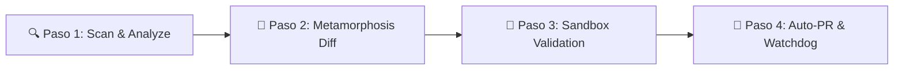

<div align="center">
  
  <h1>LEPISM</h1>
  <p><strong>Structural Health, Polyglot Dependency Intelligence &amp; Anti-Decay Engine</strong></p>
  <p>
    <a href="https://amglogicalis.github.io/lepism-repo-public/"></a>
    
    
    
    
  </p>
  <p><em>Automated dependency health, breaking-change diffing, and ephemeral sandbox validation running on GitHub Actions at $0 cost.</em></p>
</div>

---

## 🌐 Consola Web Online & Live Dashboard

Lepism incluye una **Consola Web moderna en Dark Mode con arquitectura Glassmorphism** (color primario `#48566f`) que te permite auditar dependencias, ejecutar pruebas efímeras en sandboxes aislados e inyectar workflows de actualización directamente a cualquier repositorio GitHub con 1 solo clic.

👉 **[Abrir Consola Web Online desplegada en GitHub Pages](https://amglogicalis.github.io/lepism-repo-public/)**

---

## 💡 ¿Qué es Lepism?

**Lepism** (inspirado en *Lepisma saccharina*, el lepisma plateado que sobrevive al paso del tiempo) es el motor de **salud estructural, inteligencia de dependencias y anti-decadencia** del ecosistema Terra.

A diferencia de herramientas tradicionales que abren Pull Requests ciegos o solo auditan vulnerabilidades estáticas:
* **Ejecuta tus tests reales en un Sandbox Efímero ($0)** antes de tocar producción para garantizar cero regresiones.
* **Compara la API pública y tipos de TypeScript** (Metamorphosis Diff) para mostrarte qué funciones han cambiado o se han eliminado.
* **Monitorea los ciclos de vida y fechas EOL** de tus runtimes (Node.js, Python, PostgreSQL, Ubuntu).
* **Detecta Dependencias Fantasma** (paquetes usados en código que no están declarados en el manifiesto).

---

## 🚀 Flujo Recomendado de Uso (Step-by-Step Workflow)



1. **Paso 1 — Escaneo & Molt Score (`scan` & `analyze`)**: Escanea tu `package.json`, `requirements.txt`, `Cargo.toml` o `go.mod` sin instalar paquetes. Lepism calcula tu Molt Health Score (0-100) y cruza vulnerabilidades en tiempo real con OSV.dev.
2. **Paso 2 — Inspección de Cambios de API (`metamorphosis`)**: Si una dependencia tiene un salto de versión mayor, inspecciona las firmas de funciones eliminadas o modificadas antes de escribir código.
3. **Paso 3 — Validación en Sandbox Efímero (`sandbox`)**: Genera e inyecta un runner de GitHub Actions que clona tu repo, aplica la actualización candidata y ejecuta tu suite de tests real (`npm test`, `pytest`, `cargo test`).
4. **Paso 4 — Actualización y Automatización (`autopr` & `schedule`)**: Abre Pull Requests enriquecidos con reportes de sandbox y programa el watchdog semanal para monitorizar la salud continuamente.

---

## 🛠️ Catálogo Completo de las 12 Funciones

### 🧬 MOLT Suite — Análisis e Inteligencia de Riesgo
* **🔍 Polyglot Scanner (`scan`)**: Lee manifiestos de Node.js, Python, Rust, Go y Ruby consultando registros públicos vía HTTP sin instalación.
* **🛡️ Molt Score & CVEs (`analyze`)**: Clasifica dependencias en `SAFE_MOLT` 🟢, `RISKY_MOLT` 🟡 y `TOXIC_MOLT` 🔴 calculando penalizaciones por CVEs activos y saltos mayores.
* **👻 Phantom Dependencies (`phantom`)**: Escanea código fuente con AST/Regex para identificar paquetes importados que no están declarados en los manifiestos.

### 🔬 METAMORPHOSIS Suite — Diff Profundo de APIs y Ciclos de Vida
* **🔬 API Breaking Diff (`metamorphosis`)**: Compara archivos de definición de tipos (`.d.ts`) y exports entre versiones para detectar métodos eliminados o firmas alteradas.
* **⏱️ Runtime EOL Tracker (`epoch`)**: Rastrea el calendario oficial de soporte y fin de vida (EOL) de Node.js, Python, PostgreSQL, etc., mediante la API de *endoflife.date*.
* **💥 Peer Collision Detector (`collision`)**: Encuentra conflictos de versiones cruzadas en `peerDependencies` y duplicados en el árbol de dependencias.

### 🛡️ EXOSKELETON Suite — Sandbox Efímero y Actualizaciones Seguras
* **🧪 Ephemeral Sandbox (`sandbox`)**: Ejecuta un runner efímero de GitHub Actions que valida tu suite de pruebas real contra la nueva versión sin tocar producción.
* **🦎 Smart Molt Upgrade (`molt`)**: Genera parches atómicos de manifiesto con verificación de compatibilidad previa.
* **🚀 Autonomous Auto-PR (`autopr`)**: Abre Pull Requests automáticos con el reporte de Metamorphosis y el log de validación del sandbox adjuntos.

### 🏛️ FOSSIL Suite — Registro Histórico y Automatización
* **🏛️ Genealogy Ledger (`fossil`)**: Guarda en `.lepism-storage` el historial inmutable de todas las mutaciones, auditorías y regresiones detectadas.
* **⏰ Health Watchdog Cron (`schedule`)**: Genera workflows de GitHub Actions con cron programable y alertas a Discord, Slack o GitHub Issues.
* **🔑 Locksmith Linter (`locksmith`)**: Optimiza y deduplica lockfiles (`package-lock.json`, `yarn.lock`, `Cargo.lock`) verificando sumas de integridad SHA.

---

## ⚡ Inyección Directa a Repositorios GitHub

La Consola Web cuenta con el botón **`⚡ Inyectar a Repo GitHub`** en todas las vistas de workflow. Con tu Personal Access Token (PAT), la consola inyecta automáticamente los workflows en `.github/workflows/lepism-*.yml` en tu repositorio sin necesidad de realizar commits manuales.

---

## 💻 CLI & SDK Integration

### Instalación Global

```bash
npm install -g terra-lepism
```

### Inicialización de la Bóveda de Almacenamiento

```bash
export GITHUB_TOKEN=ghp_tupersonalaccesstoken
lepism init
```

### Comandos de Ejemplo CLI

```bash
# Escaneo Polyglot
lepism molt scan --manifest package.json

# Calcular Molt Score y evaluar CVEs
lepism molt analyze --manifest package.json

# Comparar APIs entre versiones
lepism metamorp diff --package axios --from 0.27.2 --to 1.6.8

# Generar Sandbox Efímero
lepism exoskeleton sandbox --package react --version 18.3.1 --repo amglogicalis/my-app

# Iniciar la Consola Web Localhost (puerto configurable)
lepism console --port 7420
```

---

## 📄 Licencia

Desarrollado bajo licencia **MIT** dentro del ecosistema [Terra](https://github.com/amglogicalis/Terra).
